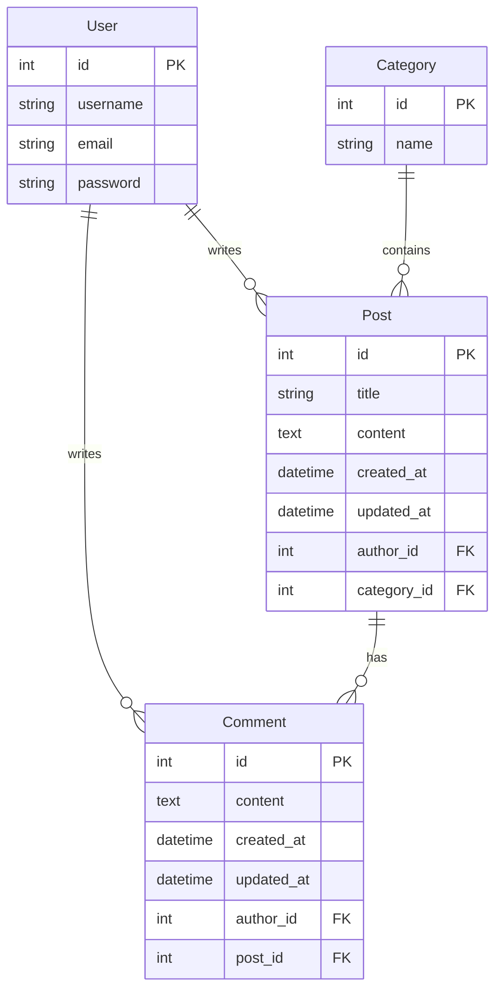

```python
# 이번주 목표
# +@ 버전관리
# 1. request, response에 대한 고찰
# 2. CBV의 대부분의 View
# 3. 1:1, 1:N, M:N 관계의 CRUD
# 4. 실전 프로젝트

# * '재현 가능'에 초점을 둡니다. 완전히 똑같이 오늘 수업을 재현할 수 있고, 그것을 반복해봐야 실력이 늘어납니다.

########################################

# window
mkdir CBV
cd CBV
python -m venv venv
.\venv\Scripts\activate

pip install django
pip install pillow

django-admin startproject config .

python manage.py migrate
python manage.py startapp blog

########################################

# mac
mkdir CBV
cd CBV

python3 -m venv venv
source venv/bin/activate

pip install django
pip install pillow

django-admin startproject config .

python manage.py migrate
python manage.py startapp blog

########################################

# 인스톨된 django 버전 관리
pip freeze > requirements.txt

# requirements.txt에 있는 버전을 설치
# pip install -r requirements.txt

########################################
# config/settings.py

ALLOWED_HOSTS = ["*"]


# Application definition
# "django.contrib.admin"이 있다면
# https://github.com/django/django/tree/main/django/contrib/admin 을 읽어옵니다!
# CBV\venv\Lib\site-packages\django\contrib\admin
# 결국 'INSTALLED_APPS'은 파일과 폴더를 읽어오는 경로명 집합입니다.

INSTALLED_APPS = [
    "django.contrib.admin",
    "django.contrib.auth",
    "django.contrib.contenttypes",
    "django.contrib.sessions",
    "django.contrib.messages",
    "django.contrib.staticfiles",
    "blog",
]

########################################
# urls 기획

1. 다음 url이 실제 작동하도록 해주세요.
1.1 'blog/'                     : 블로그 글 목록
1.2 'blog/<int:pk>/'            : 블로그 글 읽기
1.3 'blog/write/'               : 블로그 글 작성
1.4 'blog/edit/<int:pk>/'       : 블로그 글 업데이트
1.5 'blog/delete/<int:pk>/'     : 블로그 글 삭제

########################################
# 각 url에 대한 view 함수 기획
앱이름: blog                views 함수이름   html 파일이름  비고
'blog/'                     blog_list        blog_list.html	
'blog/<int:pk>'             blog_details     blog_details.html
'blog/write/'               blog_write       blog_write.html
'blog/edit/<int:pk>/'       blog_edit        blog_edit.html
'blog/delete/<int:pk>/'     blog_delete      blog_delete.html

########################################
# 각 앱에 대한 models.py 기획(기획 + ERD를 손으로 하는 시대가 지나갔습니다. 이제는 GPT + 머에드로 '프롬프트로' 그립니다.)
# GPT 프롬프트: 내가 django blog 앱을 기획하고 있어. 아래 글을 보고 models.py를 기획해주고 기획한 것을 바탕으로 ERD를 머메이드로 그려줘.

네, 기꺼이 도와드리겠습니다. Django blog 앱을 위한 models.py를 기획하고 ERD를 Mermaid로 그리겠습니다. 먼저 모델을 설계한 다음 ERD를 생성하겠습니다.

Django blog 앱을 위한 models.py 기획:

1. User 모델:
   - Django의 기본 User 모델을 사용하거나 확장할 수 있습니다.

2. Post 모델:
   - title: 게시글 제목
   - content: 게시글 내용
   - created_at: 작성 일시
   - updated_at: 수정 일시
   - author: User 모델과의 외래 키 관계
   - category: Category 모델과의 외래 키 관계

3. Category 모델:
   - name: 카테고리 이름
   - slug: URL에 사용할 문자열

4. Comment 모델:
   - content: 댓글 내용
   - created_at: 작성 일시
   - updated_at: 수정 일시
   - author: User 모델과의 외래 키 관계
   - post: Post 모델과의 외래 키 관계

5. Tag 모델:
   - name: 태그 이름

6. PostTag 모델 (다대다 관계를 위한 중간 모델):
   - post: Post 모델과의 외래 키 관계
   - tag: Tag 모델과의 외래 키 관계

이제 이 모델 구조를 바탕으로 ERD를 Mermaid로 그리겠습니다.


이 ERD는 Django blog 앱의 데이터 모델 구조를 시각화한 것입니다. 주요 특징은 다음과 같습니다:

1. User 모델은 Post와 Comment와 일대다 관계를 가집니다.
2. Post 모델은 Category와 다대일 관계를 가집니다.
3. Post와 Comment 사이에는 일대다 관계가 있습니다.
4. Post와 Tag 사이의 다대다 관계는 PostTag 중간 모델을 통해 구현됩니다.


########################################
# GPT가 만들어놓은 기획 수정
# 수정한 모델을 바탕으로 GPT에게 ERD를 다시 그려달라고 요청
# 프롬프트: 아래 모델을 바탕으로 ERD를 다시 그려주세요.
1. User 모델:
   - Django의 기본 User 모델

2. Post 모델:
   - title: 게시글 제목
   - content: 게시글 내용
   - created_at: 작성 일시
   - updated_at: 수정 일시
   - author: User 모델 1:N관계
   - category: Category 모델 1:N관계로 만들 수도 있고 N:M관계로도 만들 수 있으나, 소셜미디어가 아니라 블로그이기 때문에 1:N관계로 만들겠습니다.

3. Category 모델:
   - name: 카테고리 이름

4. Comment 모델:
   - content: 댓글 내용
   - created_at: 작성 일시
   - updated_at: 수정 일시
   - author: User 모델과의 외래 키 관계
   - post: Post 모델 1:N관계

########################################
# config > urls.py
from django.contrib import admin
from django.urls import path, include

urlpatterns = [
    path("admin/", admin.site.urls),
    path("blog/", include("blog.urls")),
]

########################################
# blog > urls.py

from django.urls import path
from . import views

# from .views import BlogListView, BlogDetailView, BlogCreateView, BlogUpdateView, BlogDeleteView
# 장점: 필요한 것만 가져오고, 목록 파악 용이
# from . import views
# 장점: 가져올 것이 많을 때, 특히 유지보수를 자주하게될 경우 용이(위에를 수정할 필요가 없기 때문에)

urlpatterns = [
    path("", views.blog_list, name="blog_list"),
    path("<int:pk>/", views.blog_detail, name="blog_detail"),
    path("new/", views.blog_new, name="blog_new"),
    path("<int:pk>/edit/", views.blog_edit, name="blog_edit"),
    path("<int:pk>/delete/", views.blog_delete, name="blog_delete"),
    path("test/", views.test, name="test"),
]

########################################
# blog > views.py

from django.shortcuts import render
from django.views.generic import (
    ListView,
    DetailView,
    CreateView,
    UpdateView,
    DeleteView,
)
from django.urls import reverse_lazy
from django.http import HttpResponse
from .models import Post

# 클래스 기반 뷰가 꼭 제네릭 뷰는 아닙니다.
# 클래스로 HttpResponse를 반환하게 하면 그것도 클래스 기반 뷰입니다.
# 실무에서는 클래스 기반 뷰를 제네릭 뷰라고 부르는 경우가 많습니다.
# 제네릭 뷰는 장고에서 제공하는 여러가지 기능을 미리 구현해 놓은 클래스 기반 뷰입니다.


class PostList(ListView):
    model = Post
    ordering = "-created_at"  # "-pk"도 가능
    # template_name = "blog/내가_원하는_파일명.html" # default: blog/post_list.html
    # context_object_name = "posts" # default: object_list
    # paginate_by = 5 # 페이지네이션(한 페이지에 몇 개를 보여줄지)


class PostDetail(DetailView):
    model = Post
    # template_name = "blog/내가_원하는_파일명.html" # default: blog/post_detail.html
    # context_object_name = "post" # default: object


class PostCreate(CreateView):
    model = Post
    fields = "__all__"
    success_url = reverse_lazy("blog_list")  # 성공했을 때 이동할 URL
    # fields = ["title", "content", "author"] # 이렇게 필드를 지정해줄 수도 있다.
    # template_name = "blog/내가_원하는_파일명.html" # default: blog/post_form.html
    # success_url = "/blog/" # default: reverse_lazy("blog_list")
    # reverse_lazy("blog_list")를 하는 이유는 object가 생성이 되고 나서 url로 이동해야 하는데 reverse는 함수이기 때문에 함수가 실행되는 시점에 url로 이동하게 되어버린다. 그래서 post가 생성된 후에 url로 이동하게 하기 위해서 기다리겠다는 함수가 reverse_lazy를 사용한다.


class PostUpdate(UpdateView):
    model = Post
    fields = "__all__"  # "__all__"도 가능
    success_url = reverse_lazy("blog_list")  # 성공했을 때 이동할 URL
    # template_name = "blog/내가_원하는_파일명.html" # default: blog/post_form.html
    # success_url = "/blog/" # default: reverse_lazy("blog_list")


class PostDelete(DeleteView):
    model = Post
    success_url = reverse_lazy("blog_list")  # 성공했을 때 이동할 URL
    # template_name = "blog/내가_원하는_파일명.html" # default: blog/post_confirm_delete.html
    # success_url = "/blog/" # default: reverse_lazy("blog_list")
    # 삭제되고 다 완료되지 않은 상태에서 blog_list로 넘어가지 않도록 하기 위해서 reverse_lazy를 사용합니다.


class PostTest(CreateView):
    model = Post

    # 메서드 오버라이딩(CreateView의 메서드를 재정의)
    def get(self, request):
        return HttpResponse("get 요청이 왔습니다.")

    def post(self, request):
        return HttpResponse("post 요청이 왔습니다.")


# 아래와 같이 사용하진 않고, urls.py에서 as_view()를 사용하여 사용하는 경우가 많습니다.
blog_list = PostList.as_view()
blog_detail = PostDetail.as_view()
blog_new = PostCreate.as_view()
blog_edit = PostUpdate.as_view()
blog_delete = PostDelete.as_view()
test = PostTest.as_view()

########################################

Django에서 ListView와 같은 일반적인 Class-Based Views (CBV)를 사용할 때, 템플릿 이름은 기본적으로 다음과 같은 규칙을 따라 자동으로 생성됩니다.

PostList (ListView)
템플릿 이름 규칙: <app_name>/<model_name_소문자>_list.html
여기서의 기본 템플릿: <app_name>/post_list.html
템플릿 접근 방법:

    {{ post.title }}



PostDetail (DetailView)
템플릿 이름 규칙: <app_name>/<model_name_소문자>_detail.html
여기서의 기본 템플릿: <app_name>/post_detail.html
템플릿 접근 방법: 
{{ object.title }}


PostCreate (CreateView)
템플릿 이름 규칙: <app_name>/<model_name_소문자>_form.html
여기서의 기본 템플릿: <app_name>/post_form.html
템플릿 접근 방법:
<form method="post">
    
    {{ form.as_p }}
    <button type="submit">Create</button>
</form>
아래와 같이 직접 템플릿을 만들어도 됩니다.
<form method="post">
    
    <input type="text" name="title">
    <textarea name="content"></textarea>
    <button type="submit">Create</button>
</form>
* update와 file명이 같습니다.


PostUpdate (UpdateView)
템플릿 이름 규칙: <app_name>/<model_name_소문자>_form.html
여기서의 기본 템플릿: <app_name>/post_form.html
템플릿 접근 방법:
<form method="post">
    
    {{ form.as_p }}
    <button type="submit">Update</button>
</form>
* create와 file명이 같습니다.


PostDelete (DeleteView)
템플릿 이름 규칙:  <app_name>/<model_name_소문자>_confirm_delete.html
여기서의 기본 템플릿: <app_name>/post_confirm_delete.html
템플릿 접근 방법:
<form method="post">
    
    Are you sure you want to delete "{{ object.title }}"?
    <button type="submit">Delete</button>
</form>


* CreateView와 UpdateView는 같은 템플릿 이름 규칙을 사용합니다. 그래서 둘 다 _form.html을 기본으로 사용합니다.

########################################
# blog > templates > blog > post_list.html

<h2>Post List</h2>
<ul>
    
    <li>
        <a href="">{{ post.title }}</a>
    </li>
    
</ul>

########################################
# blog > templates > blog > post_detail.html

<h2>{{ object.title }}</h2>
<p>{{ object.content }}</p>


########################################
# blog > templates > blog > post_form.html

<h2>Create / Update</h2>
<form method="post">
    
    {{ form.as_p }}
    <button type="submit">저장</button>
</form>

########################################
# blog > templates > blog > post_confirm_delete.html

<h2>Delete</h2>
<form method="post">
    
    <p>"{{ object.title }}"을 정말로 삭제하시겠습니까?</p>
    <a href="">취소</a>
    <button type="submit">삭제</button>
</form>

########################################
# blog > models.py

# upload_to를 문자열이나 함수로 사용하는 이유
# 1. 보안상 추적이 어려운 파일명을 가지도록 하기 위해서(연월일을 해쉬해서 사용합니다.)
# 2. 성능상 하나의 폴더에 너무 많은 파일이 들어가게 되면 성능이 저하됩니다. 때문에 연월일로 나누어서 저장합니다.

from django.db import models
from django.contrib.auth.models import User


class Category(models.Model):
    name = models.CharField(max_length=100, unique=True)

    def __str__(self):
        return self.name

    class Meta:
        verbose_name_plural = "Categories"


class Post(models.Model):
    title = models.CharField(max_length=200)
    content = models.TextField()
    created_at = models.DateTimeField(auto_now_add=True)
    updated_at = models.DateTimeField(auto_now=True)
    head_image = models.ImageField(upload_to="blog/images/%Y/%m/%d/", blank=True)
    # 1:N 관계에서 N에 해당하는 Post 모델에 ForeignKey로 User 모델을 연결합니다.
    author = models.ForeignKey(User, on_delete=models.CASCADE, related_name="posts")
    category = models.ForeignKey(
        Category, on_delete=models.SET_NULL, null=True, related_name="posts"
    )

    def __str__(self):
        return self.title

    class Meta:
        ordering = ["-created_at"]

########################################
# blog > admin.py
from django.contrib import admin
from .models import Post, Category

admin.site.register(Post)
admin.site.register(Category)

########################################

python manage.py makemigrations
python manage.py migrate

########################################

python manage.py createsuperuser

leehojun
leehojun@gmail.com
dlghwns1234!

########################################
# config > settings.py

# 내가 사용할 정적 파일입니다.
# 예를 들어 logo.png 파일 같은 것을 얘기합니다.
STATIC_URL = "static/"
STATICFILES_DIRS = [BASE_DIR / "static"]

# 사용자가 업로드한 파일을 저장할 디렉토리를 지정합니다.
MEDIA_URL = "/media/"
MEDIA_ROOT = BASE_DIR / "media"

########################################

# 방식이 여러가지인데 아래 방식말고도 다양한 방식이 있습니다.

django-storages, django-s3-storage


1. 프론트엔드에서 이미지 선택:
   - 사용자가 웹 인터페이스에서 이미지를 선택합니다.

2. 프론트엔드에서 백엔드로 이미지 전송:
   - 선택된 이미지를 포함한 폼 데이터를 Django 백엔드로 전송합니다.
   - 이는 일반적으로 POST 요청을 통해 이루어집니다.

3. Django 백엔드에서 이미지 수신:
   - Django 뷰에서 전송된 이미지 파일을 받습니다.

4. S3 업로드를 위한 임시 URL 생성:
   - Django 백엔드에서 AWS S3에 직접 업로드할 수 있는 임시 URL(pre-signed URL)을 생성합니다.
   - 이 URL은 보안을 위해 제한된 시간 동안만 유효합니다.

5. 임시 URL을 프론트엔드로 반환:
   - 생성된 임시 URL을 프론트엔드로 전송합니다.

6. 프론트엔드에서 S3로 직접 업로드:
   - 프론트엔드는 받은 임시 URL을 사용하여 이미지를 S3에 직접 업로드합니다.
   - 이 방식은 서버 부하를 줄이고 업로드 속도를 향상시킵니다.

7. 업로드 완료 후 S3 URL 획득:
   - 업로드가 완료되면 S3에서 해당 이미지의 URL을 받습니다.

8. S3 URL을 Django로 전송:
   - 프론트엔드는 S3 URL과 함께 필요한 다른 데이터를 Django 백엔드로 전송합니다.

9. Django에서 데이터베이스에 정보 저장:
   - Django는 받은 S3 URL을 데이터베이스의 해당 모델 필드에 저장합니다.
   - 이 URL은 나중에 이미지를 표시할 때 사용됩니다.

10. 저장 완료 응답:
    - Django는 저장이 완료되었다는 응답을 프론트엔드로 보냅니다.

11. 프론트엔드에서 완료 처리:
    - 프론트엔드는 저장 완료 응답을 받고 필요한 UI 업데이트를 수행합니다.

########################################

from django.contrib import admin
from django.urls import path, include
from django.conf.urls.static import static
from django.conf import settings

urlpatterns = [
    path("admin/", admin.site.urls),
    path("blog/", include("blog.urls")),
]

# 실무에서는 이런식으로 잘 사용하지 않습니다.
# why? Django서버는 미디어를 serving하는 프레임워크가 아니에요.
# 이미지나 영상은 nginx, apache같은 웹서버를 이용해서 서빙하거나 AWS S3같은 클라우드 서비스를 이용하는 것이 좋습니다.
urlpatterns += static(settings.MEDIA_URL, document_root=settings.MEDIA_ROOT)

########################################

http://127.0.0.1:8000/blog/
http://127.0.0.1:8000/blog/1/
http://127.0.0.1:8000/blog/new/
http://127.0.0.1:8000/blog/1/edit/
http://127.0.0.1:8000/blog/1/delete


########################################
# 검색기능 추가(CBV에 검색이 어떤 식으로 작동하는지 이해하기 위한 예제)
# blog > post_list.html

<h2>Post List</h2>
<form action="" method="get">
    <input name="q" type="text">
    <button type="submit">검색</button>
</form>
<ul>
    
    <li>
        <a href="">{{ post.title }}</a>
    </li>
    
</ul>

########################################
# blog > views.py

from django.db.models import Q


class PostList(ListView):
    model = Post
    ordering = "-created_at"  # "-pk"도 가능
    # template_name = "blog/내가_원하는_파일명.html" # default: blog/post_list.html
    # context_object_name = "posts" # default: object_list
    # paginate_by = 5 # 페이지네이션(한 페이지에 몇 개를 보여줄지)

    def get_queryset(self):
        """
        get_queryset은 템플릿에서 사용할 {{object_list}}를 만드는 함수입니다.
        일반적으로는 Post.objects.all()과 같은 역할을 합니다.
        그런데 우리는 특수한 코드 분기를 위해 이 함수를 오버라이딩(재정의)합니다.

        127.0.0.1:8000 GET 이걸로 들어오게 되면?
        127.0.0.1:8000?q=hello GET 이걸로 들어오게 되면?
        127.0.0.1:8000?q=hello&name=hojun GET 이걸로 들어오게 되면?
        """
        queryset = super().get_queryset()  # Post.objects.all()과 같은 역할을 합니다.
        # 템플릿에서는 {{object_list}}로 사용할 수 있습니다.
        q = self.request.GET.get("q", "")  # q라는 이름으로 GET 요청을 받습니다.
        if q:
            # q의 값을 가지고 있는 데이터를 추출합니다.
            # queryset = queryset.filter(title__icontains=q)
            queryset = queryset.filter(
                Q(title__icontains=q) | Q(content__icontains=q)
            ).distinct()
        return queryset

########################################

ListView의 기본 get_queryset 메서드는 model 속성에서 정의된 모델의 전체 객체 목록을 반환합니다. PostList 뷰에서 model = Post로 정의되어 있어 기본적으로 Post 모델의 모든 객체를 반환하게 됩니다.

super().get_queryset() 호출은 Post 모델의 전체 객체 목록을 반환합니다.

########################################

공식문서
https://docs.djangoproject.com/en/5.1/ref/class-based-views/
ListVeiw : https://docs.djangoproject.com/en/5.1/ref/class-based-views/generic-display/
CreateView : https://docs.djangoproject.com/en/5.1/ref/class-based-views/generic-editing/

################################

Base views
    View : 최상위 제네릭 뷰, 기본 뷰, django view를 만드는데 필요한 기능 제공
    TemplateView : 템플릿이 주어지면 렌더링을 해주는 뷰
    RedirectView : URL이 주어지면 리다이렉트 해주는 뷰

Generic display views
    DetailView : model과 템플릿 받아 조건에 맞는 상세 오브젝트를 보여줍니다.(V)
    ListView : model과 템플릿 받아 전체 오브젝트를 보여줍니다.(V)

Generic editing views
    FormView : 폼을 보여주고 처리합니다.(V)
    CreateView : 폼을 보여주고 객체를 생성합니다.(V)
    UpdateView : 폼을 조건에 맞게 보여주고 객체를 수정합니다. (V)
    DeleteView : 객체를 삭제합니다.(V)

Generic date views
    ArchiveIndexView : 조건에 맞는 객체의 날짜 정보를 출력합니다.
    YearArchiveView : 연도에 맞는 객체를 출력합니다.
    MonthArchiveView : 월에 맞는 객체를 출력합니다.
    WeekArchiveView : 주에 맞는 객체를 출력합니다.
    DayArchiveView : 일에 맞는 객체를 출력합니다.
    TodayArchiveView : 오늘 날짜에 객체를 출력합니다.
    DateDetailView : 연, 월, 일 조건에 맞는 객체를 출력합니다.

################################

# 공식 홈페이지 샘프로 코드 포함

Base views
    View : 최상위 제네릭 뷰, 기본 뷰, django view를 만드는데 필요한 기능 제공
    TemplateView : 템플릿이 주어지면 렌더링을 해주는 뷰
    '''
    from django.views.generic.base import TemplateView
    from articles.models import Article

    class HomePageView(TemplateView):
        template_name = "home.html"

        def get_context_data(self, **kwargs):
            context = super().get_context_data(**kwargs)
            context["latest_articles"] = Article.objects.all()[:5]
            return context
    '''
    RedirectView : URL이 주어지면 리다이렉트 해주는 뷰

Generic display views
    DetailView : model과 템플릿 받아 조건에 맞는 상세 오브젝트를 보여줍니다.
    '''
    from django.utils import timezone
    from django.views.generic.detail import DetailView
    from articles.models import Article

    class ArticleDetailView(DetailView):
        model = Article

        def get_context_data(self, **kwargs):
            context = super().get_context_data(**kwargs)
            context["now"] = timezone.now()
            return context
    '''
    '''
    <h1>{{ object.headline }}</h1>
    <p>{{ object.content }}</p>
    <p>Reporter: {{ object.reporter }}</p>
    <p>Published: {{ object.pub_date|date }}</p>
    <p>Date: {{ now|date }}</p>
    '''
    ListView : model과 템플릿 받아 전체 오브젝트를 보여줍니다.
    '''
    from django.utils import timezone
    from django.views.generic.detail import DetailView
    from articles.models import Article

    class ArticleDetailView(DetailView):
        model = Article

        def get_context_data(self, **kwargs):
            context = super().get_context_data(**kwargs)
            context["now"] = timezone.now()
            return context
    '''
    '''
    <h1>{{ object.headline }}</h1>
    <p>{{ object.content }}</p>
    <p>Reporter: {{ object.reporter }}</p>
    <p>Published: {{ object.pub_date|date }}</p>

    <p>Date: {{ now|date }}</p>
    '''

Generic editing views
    FormView : 폼을 보여주고 처리합니다.
    CreateView : 폼을 보여주고 객체를 생성합니다.
    UpdateView : 폼을 조건에 맞게 보여주고 객체를 수정합니다. 
    DeleteView : 객체를 삭제합니다.

Generic date views
    ArchiveIndexView : 조건에 맞는 객체의 날짜 정보를 출력합니다.
    YearArchiveView : 연도에 맞는 객체를 출력합니다.
    MonthArchiveView : 월에 맞는 객체를 출력합니다.
    WeekArchiveView : 주에 맞는 객체를 출력합니다.
    DayArchiveView : 일에 맞는 객체를 출력합니다.
    TodayArchiveView : 오늘 날짜에 객체를 출력합니다.
    DateDetailView : 연, 월, 일 조건에 맞는 객체를 출력합니다.
    '''
    # views.py
    from django.views.generic.dates import WeekArchiveView
    from myapp.models import Article

    class ArticleWeekArchiveView(WeekArchiveView):
        queryset = Article.objects.all()
        date_field = "pub_date"
        week_format = "%W"
        allow_future = True
    
    # urls.py
    from django.urls import path
    from myapp.views import ArticleWeekArchiveView

    urlpatterns = [
        # Example: /2012/week/23/
        path(
            "<int:year>/week/<int:week>/",
            ArticleWeekArchiveView.as_view(),
            name="archive_week",
        ),
    ]

    # article_archive_week.html:
    <h1>Week {{ week|date:'W' }}</h1>

    <ul>
        
            <li>{{ article.pub_date|date:"F j, Y" }}: {{ article.title }}</li>
        
    </ul>

    <p>
        
            Previous Week: {{ previous_week|date:"W" }} of year {{ previous_week|date:"Y" }}
        
        --
        
            Next week: {{ next_week|date:"W" }} of year {{ next_week|date:"Y" }}
        
    </p>
    '''

################################
from django.contrib import admin
from .models import Post, Category

# admin.site.register(Post)
admin.site.register(Category)


class PostAdmin(admin.ModelAdmin):
    list_display = ("title", "content", "created_at")


admin.site.register(Post, PostAdmin)
```


